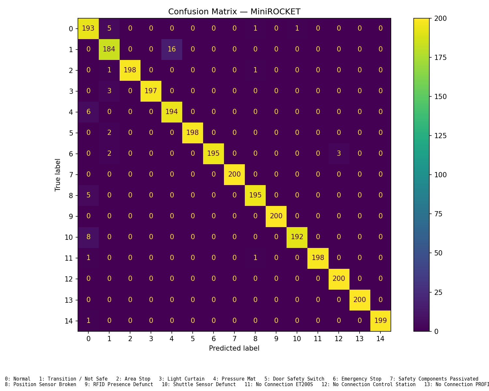

# Station 60 Fault Detection

> Classify multivariate sensor windows from the AutFab Station 60 pneumatic press with two independent MiniROCKET-based time-series pipelines.

**Domain:** Industrial AI / multivariate time-series classification
**Hardware:** AutFab smart-factory Station 60 pneumatic press (data source); CPU-only laboratory PC for the recorded Aeon run
**Tools:** Python 3.10+, aeon or sktime, NumPy, SciPy, pandas, scikit-learn, Numba, Matplotlib

## Overview

The AutFab Station 60 press produces multichannel sensor traces during normal operation, faults, and recovery. This repository preserves two independent implementations for classifying those traces with MiniROCKET features and a linear classifier.

`Aeon-Implementation` is Jing Wen's implementation. `Sktime-Implement` is retained as a separate team implementation. Their data preparation, window labels, class balancing, and evaluation sets differ, so their reported metrics are evidence for each module only—not a like-for-like benchmark.

## Key Results

| Module | Result | Validation evidence |
|---|---:|---|
| Aeon | 98.10% accuracy; 0.9812 Macro F1 | Saved 3,000-sample, 15-class result summary |
| Aeon | 0.365 ms/sample inference; 32.16 s training | Saved result summary from the recorded CPU run |
| sktime | 94.66% accuracy; 0.9460 weighted F1 | Saved 2,358-sample experiment result |
| sktime | 15.61 ms/sample mean inference; 24.57 s training | Saved experiment result, seed 42 |

## Project Map

```text
.
├── modules/
│   ├── Aeon-Implementation/       # Jing Wen's 15-class Aeon pipeline
│   │   ├── main.py                # Run entry point
│   │   ├── config.py              # Windowing and model settings
│   │   └── results/               # Saved confusion matrices and summaries
│   └── Sktime-Implement/          # Independent sktime MiniROCKET pipeline
│       ├── Auto_fab_Minirocket.py # Run entry point
│       ├── data/convert_to_tsV3.py# Conversion utility for .ts input
│       └── results/               # Saved experiment outputs
├── README.md
└── .gitignore
```

## Quick Start

### Prerequisites

- Python 3.10 or later.
- Permitted Station 60 recordings. Raw CSV data is not included because it comes from the AutFab laboratory.
- Run commands from the selected module directory; each module has its own dependency list.

### Aeon pipeline

```bash
cd modules/Aeon-Implementation
pip install -r requirements.txt
# Place permitted recordings in data/raw/
python main.py
```

The code writes a timestamped directory below `results/` with a summary, configuration snapshot, log, and confusion matrix. This command is documented from the implementation but was not re-run in this workspace because neither Python nor the private raw data is available here.

### sktime pipeline

```bash
cd modules/Sktime-Implement
pip install -r requirements.txt
bash run.txt
```

`run.txt` rebuilds the `.ts` dataset from the permitted inputs and then runs `Auto_fab_Minirocket.py`. Inspect and adapt the input commands in `data/autofab_merged_commands.txt` before running.

---

## Module 1 — Aeon Fault-Classification Pipeline

### The Problem

Station recordings have variable source rates (56–79 Hz), mixed fault/recovery intervals, and severe class imbalance. A window classifier must avoid learning label-boundary artefacts while remaining useful at fault onset.

### The Implementation

The pipeline resamples sensor channels to 64 Hz, remaps recovery-only labels 15–17 to the “station not safe” class, and applies per-channel normalisation fitted on training data only. It combines clean *Pure Window* training samples with *First Fault Label* windows for onset behaviour. Minority classes use smaller strides; samples are capped and augmented with low-amplitude Gaussian noise. MiniROCKET uses 10,000 kernels, followed by a Ridge classifier.

The main controls are centralised in [config.py](modules/Aeon-Implementation/config.py), while [preprocessing.py](modules/Aeon-Implementation/preprocessing.py), [dataset.py](modules/Aeon-Implementation/dataset.py), and [train_eval.py](modules/Aeon-Implementation/train_eval.py) implement the pipeline.

### The Performance

| Recorded configuration | Value | Result | Trade-off |
|---|---:|---:|---|
| Final evaluation | 15 classes; 3,000 test samples | 98.10% accuracy; 0.9812 Macro F1 | Test data is augmented to balance classes |
| MiniROCKET inference | CPU run | 0.365 ms/sample | Hardware specification was not saved |
| Training | 10,000 kernels | 32.16 s | Results depend on the private recordings |



*Figure: Aeon MiniROCKET confusion matrix from the saved final 15-class evaluation.*

### Limitations & Next Steps

The recorded Pressure Mat fault segment is short and can be confused with the transition class. The balanced test set also contains augmented samples, so it is not a substitute for a newly collected, untouched held-out recording set. The next step is to collect longer recordings for short fault types and validate the model on a file-level held-out deployment dataset without test augmentation.

## Module 2 — sktime MiniROCKET Pipeline

### The Problem

This independent implementation explores MiniROCKET on the same Station 60 problem while retaining all 18 labels and generating windows from converted `.ts` time-series data.

### The Implementation

[Auto_fab_Minirocket.py](modules/Sktime-Implement/Auto_fab_Minirocket.py) creates random-length sliding windows around a nominal length of 80, uses the final label in each window, and splits generated windows into training and test sets. It sets NumPy's random seed to 42, balances classes through resampling, transforms multivariate series with `MiniRocketMultivariate`, and fits `RidgeClassifierCV`. [convert_to_tsV3.py](modules/Sktime-Implement/data/convert_to_tsV3.py) converts permitted input files to the required `.ts` format.

### The Performance

| Recorded configuration | Value | Result | Trade-off |
|---|---:|---:|---|
| Saved evaluation | 18 labels; 2,358 test samples | 94.66% accuracy; 0.9460 weighted F1 | Different labels and split from Aeon |
| Training | seed 42 | 24.57 s | Generated windows are split after windowing |
| Inference | Mean | 15.61 ms/sample | Timing hardware was not recorded |

The saved [results.txt](modules/Sktime-Implement/results/results.txt) contains the full confusion matrix, timing values, and selected Ridge regularisation value.

### Limitations & Next Steps

The train/test split happens after sliding-window generation, so adjacent windows from the same source sequence may occur on both sides of the split. The next step is a file-level or recording-level split before window generation, followed by evaluation on an untouched recording set. Its 18-label policy also needs a deliberate alignment decision before comparison with the Aeon module.

## Design Decisions

| Decision | Rationale | Consequence / trade-off |
|---|---|---|
| Keep the implementations in separate modules | Preserve individual ownership and avoid overwriting incompatible pipelines | Dependencies and run paths are separate |
| Retain saved results, omit raw CSV recordings | Results remain inspectable without publishing laboratory data | Full reproduction requires authorised data access |
| Do not compare headline metrics directly | Module label policies and split strategies differ | A common evaluation protocol is required for a fair benchmark |

## Files

| File or directory | Description |
|---|---|
| [modules/Aeon-Implementation/main.py](modules/Aeon-Implementation/main.py) | Runs Jing Wen's Aeon pipeline and saves timestamped outputs |
| [modules/Aeon-Implementation/results](modules/Aeon-Implementation/results) | Recorded result summaries, figures, and configuration snapshots |
| [modules/Sktime-Implement/Auto_fab_Minirocket.py](modules/Sktime-Implement/Auto_fab_Minirocket.py) | Runs the independent sktime pipeline |
| [modules/Sktime-Implement/data](modules/Sktime-Implement/data) | `.ts` conversion and dataset-construction commands |

## Data, Safety, and Reproducibility

- **Data:** Sensor recordings were collected from the AutFab smart factory at Hochschule Darmstadt. The raw data is not included because of laboratory data-privacy restrictions.
- **Safety:** This repository analyses recorded data. Any new acquisition on the pneumatic press must follow the laboratory's operating and stop procedures.
- **Reproducibility:** Saved outputs and dependency files are tracked. Running either pipeline requires authorised input data; neither pipeline was re-executed during this README update because the current workspace has no Python interpreter or raw data.

## Acknowledgments

This project was developed in the *Master Team Projects* course of the M.Sc. Electrical Engineering and Information Technology, Automation specialisation, at Hochschule Darmstadt (h-da), Faculty of Electrical Engineering and Information Technology.

The project was supervised by Prof. Dr. Stephan Simons and Heiko Webert, M.Sc. The team was Jing Wen and Hoang Viet Tung. Sensor data originated from the AutFab Station 60 laboratory.
